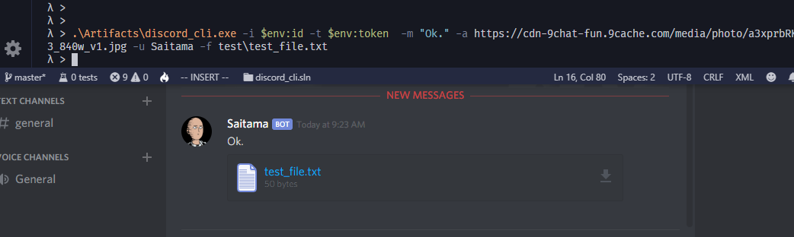

# .NET Command line application to send messages to a Discord webhook


discord_cli is a command line interface to send messages with an optional attachment to a discord webhook.  You must have the id and token for the webhook.

## Usage

The minimum options needed are the Discord webhook id (i), webhook token (t) and a message (m).  Optionally, supply a username (u), a url for an avatar (a), or a path to a file (f) to send.

```
λ > .\discord_cli.exe --help
discord_cli 1.0.0Copyright (C) 2019 discord_cli

  -i, --webhook_id       Required. Discord webhook id.

  -t, --webhook_token    Required. Discord webhook token.

  -u, --user             Optional. The userid the message will appear from.

  -a, --avatar_url       Optional. Url for the avatar.

  -m, --message          Required. Message to send to the webhook.

  -f, --file             Optional. File attachment to send to the webhook.  This is file name that
                         should optionally include the path.

  --help                 Display this help screen.

  --version              Display version information.
```

## Sample Usage

Example usage with all command line switches.

```
discord_cli.exe -i XXXXXXXXXXXXXXXXXX -t TTTTTTTTTTTTTTTTTTTTTTTTTTTTTTTTTTTTTTTTTTTTTTTTTTTTTTTTTTTTTTTTTTTT  -m "Ok." -a https://cdn-9chat-fun.9cache.com/media/photo/a3xprbRK3_840w_v1.jpg -u Saitama -f test\test_file.txt

```

Screenshot showing the message received in a Discord server.




## Building

This application takes advantage of the trimmed and self-contained single executable features in .NET Core 3.0 so there will be no support dll libraries with the executable.

A cake (v 0.34.1) build file is provided but is not necessary.  To build the application with cake, just run the supplied build script.
```
.\build.ps1 -Target Release
```

If you prefer to build with dotnet, this should do what you need:

```
dotnet publish -r win-x64 -c Release 
```

This is tested on Windows 10.